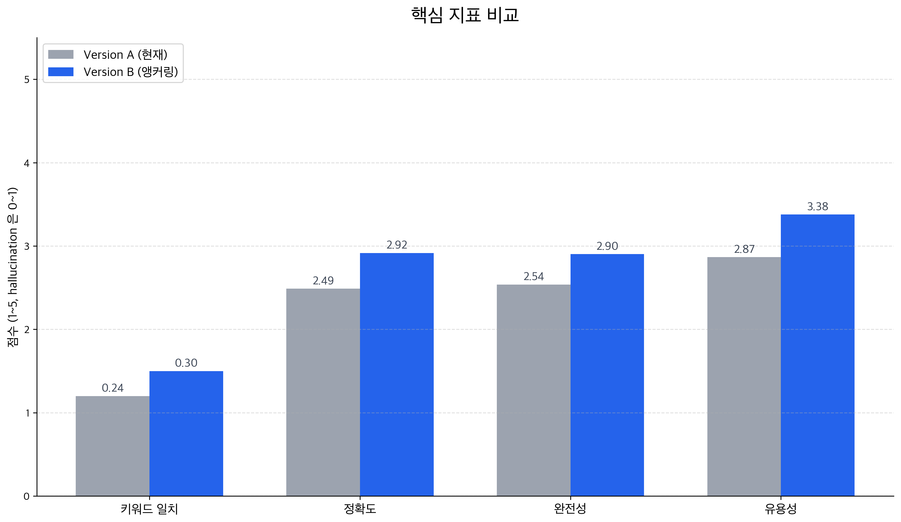
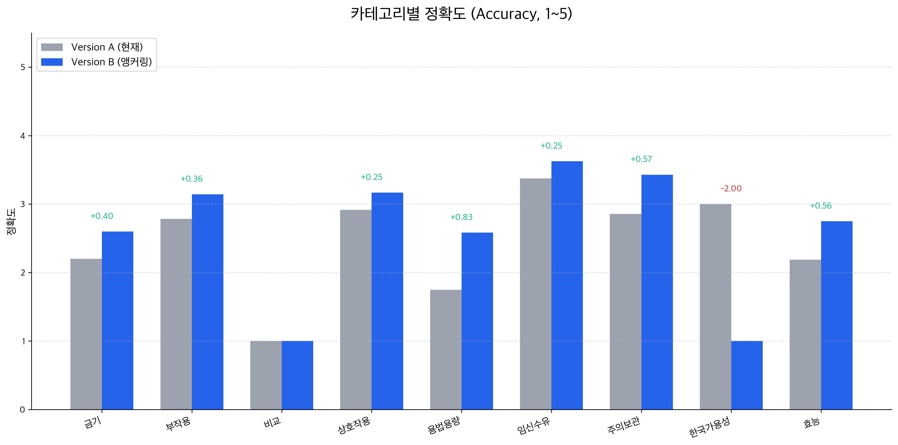
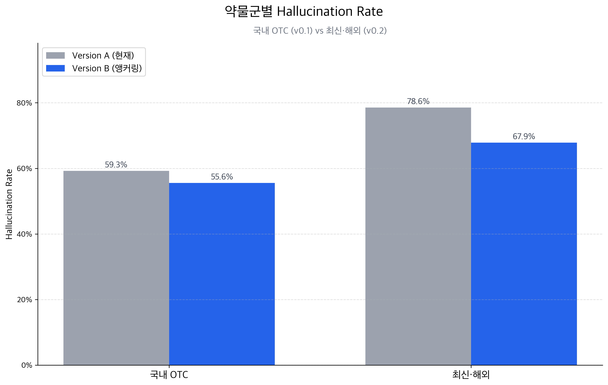

# Chatbot RAG 전환 — Version A vs B 베이스라인 측정 리포트

- **측정일**: 2026-04-21
- **대상**: Mediforme Chatbot 도메인
- **범위**: Version A (현재 프로덕션 재현) vs Version B (약 메타데이터 앵커링)
- **골든셋**: v0.1 + v0.2 (총 82문항, 모든 항목 `verified:false`)

---

## 1. 요약 (Executive Summary)

Version A(현재 챗봇)는 82문항 중 **54건(65.9%)에서 hallucination**을 보였으며, 정확도 평균은 2.49/5점으로 환자 안전 관점에서 수용하기 어려운 수준입니다.
Version B(약 메타데이터를 시스템 프롬프트로 주입하는 앵커링 방식)를 적용하면 hallucination이 59.8%로 감소하고 정확도·완전성·유용성이 모두 소폭 개선됩니다. 다만 hallucination은 **여전히 60% 수준으로 매우 높고**, hard 난이도 질문과 약물 비교 카테고리에서는 거의 개선이 없습니다.

**결론: Version C (RAG 도입)를 진행할 정당성이 수치로 확인되었습니다.** 앵커링만으로는 부족합니다.

**Hero 지표**


---

## 2. 측정 환경

| 항목 | 값 |
|---|---|
| 생성기 모델 | `gpt-3.5-turbo` (현재 프로덕션 동일) |
| Judge 모델 | `gpt-4o` (OpenAI, `response_format=json_object`) |
| 골든셋 v0.1 | 국내 OTC 8종 × 7카테고리 (54문항) |
| 골든셋 v0.2 | 최신·해외 약물 8종 (28문항) |
| 총 문항 | 82 |
| 측정 문항당 LLM 호출 | 2회 (생성 1 + judge 1) |
| 총 호출 | 82 × 2 × 2버전 = 328건 |
| 골든셋 검증 상태 | 전 항목 `verified:false` (한계 참조) |

**재현 명령**

```bash
cd eval/chatbot-rag
python3 -m venv .venv && .venv/bin/pip install -r requirements.txt
# .env 에 OPENAI_API_KEY 설정
.venv/bin/python run_eval.py --version A
.venv/bin/python run_eval.py --version B
.venv/bin/python charts.py \
  --a results/A-baseline-<timestamp>.json \
  --b results/B-anchoring-<timestamp>.json \
  --out reports/charts --date 2026-04-21
```

---

## 3. 전체 지표 비교



| 지표 | A (현재) | B (앵커링) | Δ (절대) | Δ (상대) |
|---|---:|---:|---:|---:|
| Keyword Recall | 0.240 | 0.300 | +0.060 | **+25.0%** |
| Judge Accuracy (1-5) | 2.49 | 2.92 | +0.43 | **+17.1%** |
| Judge Completeness (1-5) | 2.54 | 2.90 | +0.36 | **+14.4%** |
| Judge Helpfulness (1-5) | 2.87 | 3.38 | +0.51 | **+17.9%** |
| Hallucination Rate | 65.9% | 59.8% | −6.1%p | **−9.3%** |

네 가지 품질 지표가 일관되게 개선되었으며, 상대 개선폭은 14–25% 범위입니다. 그럼에도 hallucination rate는 여전히 60% 수준으로, 환자 안전 중심 서비스에 배포하기 어려운 품질입니다.

---

## 4. 카테고리별 비교



| 카테고리 | n | A acc | B acc | Δ |
|---|---:|---:|---:|---:|
| 용법용량 | 12 | 1.75 | 2.58 | **+0.83** |
| 주의보관 | 7 | 2.86 | 3.43 | +0.57 |
| 효능 | 16 | 2.19 | 2.75 | +0.56 |
| 금기 | 10 | 2.20 | 2.60 | +0.40 |
| 부작용 | 14 | 2.79 | 3.14 | +0.36 |
| 상호작용 | 12 | 2.92 | 3.17 | +0.25 |
| 임신수유 | 8 | 3.38 | 3.62 | +0.25 |
| 비교 | 2 | 1.00 | 1.00 | **±0.00** |
| 한국가용성 | 1 | 3.00 | 1.00 | −2.00* |

\* n=1 이라 단일 사례 영향. 해석에 주의가 필요합니다.

**관찰**

- **용법용량**에서 가장 큰 개선(+0.83). 약 이름만 시스템 프롬프트로 박아도 LLM이 해당 약의 정확한 용량 정보를 떠올리게 됩니다.
- **비교**(마운자로 vs 오젬픽 등)는 앵커링 무효. 단일 약 컨텍스트만으로는 복수 약 비교 질문을 해결하지 못합니다. RAG로 두 약의 라벨을 동시에 retrieve 해야 개선 기대.
- 임신수유·상호작용은 개선폭이 작습니다. 성분·경고 정보가 메타데이터에 포함되지 않아 LLM의 기존 지식에 의존하기 때문으로 추정됩니다. RAG 로 실제 라벨 `pregnancy`·`drug_interactions` 섹션을 주입하면 크게 개선될 후보입니다.

---

## 5. 난이도별 비교

| 난이도 | n | A acc | B acc | Δ |
|---|---:|---:|---:|---:|
| easy | 21 | 3.19 | 3.62 | +0.43 |
| medium | 36 | 2.39 | 2.97 | +0.58 |
| hard | 25 | 2.04 | 2.24 | **+0.20** |

**Hard 질문(최신·해외 약물 다수 포함)에서 앵커링 효과가 가장 작습니다.** LLM 학습 데이터에 정보 자체가 부족한 경우 약 이름만 알려주는 것으로는 해결되지 않음을 시사합니다. 이는 RAG 가 가장 가치 있게 기여할 구간입니다.

---

## 6. 약물군별 Hallucination



| 약물군 | A hallucination | B hallucination | Δ (%p) |
|---|---:|---:|---:|
| 국내 OTC (v0.1) | 59.3% | 55.6% | **−3.7**p |
| 최신·해외 (v0.2) | 78.6% | 67.9% | **−10.7**p |

두 가지 중요한 신호:

1. **baseline에서 해외·최신 약물의 hallucination 이 국내 대비 20%p 높음** — LLM 학습 컷오프 이후 승인된 약물(위고비·마운자로 등)에서 사전학습 지식이 부족하다는 증거.
2. **앵커링의 개선 효과가 해외·최신 약물에서 약 3배 큼** — 약 이름을 명시하는 것만으로도 LLM의 "혼동" 이 줄어듬. 다만 67.9%로 여전히 매우 높아, RAG 를 통한 실제 라벨 근거 제공이 필수.

---

## 7. 앵커링 효과·한계 — 정성 사례

측정 결과 82문항 중 분포:

| 분류 | 건수 |
|---|---:|
| A 환각 → B 해결 (앵커링 성공) | 16 |
| A·B 둘 다 환각 (RAG 필요) | 38 |
| 둘 다 문제 없음 | 17 |
| A 정상 → B 환각 (회귀) | 11 |

### 7.1 앵커링이 살린 사례

**[tylenol-dose] 타이레놀 용법용량**

- Q: "성인은 타이레놀 한 번에 몇 알 먹어야 해요?"
- **A (acc=2)**: "4–6시간 간격으로 **최대 8정**까지 복용할 수 있습니다" ← mg 단위 누락, 1회 복용량 부정확
- **B (acc=4)**: "한 번에 1~2정 정도 복용하는 것이 일반적입니다... 하루 최대 복용량을 넘기지 않도록 주의" ← 표준 용법에 부합

### 7.2 앵커링도 못 살린 사례 (RAG 필요)

**[tylenol-effect] 타이레놀 효능 — 안전성 오정보**

- Q: "타이레놀은 어떤 증상에 먹는 약인가요?"
- **A**: "…**간 기능이 저하된 환자들에게도 안전하게 사용할 수 있는 약**입니다" ← **중증 간질환 환자는 금기**이므로 환자 안전에 위험한 오답
- **B**: "통증, 발열… **항염증 효과가 없음**" ← 개선되었지만 "항염증 효과가 없다"는 진술은 라벨 용도와 정확히 일치하지 않음

이런 사례는 단순 약 이름 앵커링만으로는 못 잡고, 실제 라벨의 `contraindications`·`warnings` 섹션을 컨텍스트로 넣어야 안전합니다.

### 7.3 회귀 사례 (A 정상 → B 환각)

11건 발생. 시스템 프롬프트가 추가되며 LLM이 "이 약에 관련된" 무관한 정보를 유추해 추가한 케이스가 관찰되었습니다. RAG 단계에서는 사실 기반 컨텍스트가 이 유형을 억제할 것으로 기대됩니다.

---

## 8. 운영 관점

| 항목 | A | B | 변화 |
|---|---:|---:|---:|
| p50 latency (ms) | 2,256 | 2,440 | +8% |
| p95 latency (ms) | 4,693 | 4,226 | −10% |
| 입력 토큰 총계 | 2,352 | 18,050 | **×7.7** |
| 출력 토큰 총계 | 17,720 | 19,814 | +12% |

- 입력 토큰이 약 7.7배 증가합니다. 시스템 프롬프트(약 메타데이터 + 안전 가드레일)를 매 요청마다 포함하기 때문입니다. `gpt-3.5-turbo` 기준 입력 $0.50/1M 토큰이므로 절대 비용 증분은 미미합니다.
- latency 는 유의미한 악화가 없습니다. p95 는 오히려 개선되었는데, 시스템 프롬프트가 응답을 더 간결·구조적으로 만들어 생성 시간을 줄였을 가능성이 있습니다.

---

## 9. 결론 및 권고

### 수치로 확인된 것

- 앵커링만으로도 **정확도·완전성·유용성**이 14–25% 개선됩니다.
- **용법용량·주의보관·효능** 같이 단일 약에 귀속되는 정보 중심 카테고리에서 효과가 큽니다.
- **해외·최신 약물**에서 baseline 품질이 가장 나쁘며, 앵커링 효과도 가장 큽니다.

### 수치로 확인된 한계

- hallucination rate 59.8%로 **여전히 환자 서비스 수준에 미달**.
- **Hard 질문** 개선폭이 0.20에 그칩니다.
- **비교(두 약 대비)·상호작용·임신수유**는 단일 약 메타데이터로는 해결 불가.
- 82문항 중 38건(46%)이 A·B 모두 환각 → **RAG 필요 후보**.

### 권고 — Version C (RAG) 진행

Phase B 목표대로 RAG 를 도입합니다. 데이터 소스 우선순위는 다음 순서를 추천합니다.

1. **FDA openFDA 라벨**의 `indications_and_usage`, `warnings`, `contraindications`, `drug_interactions`, `pregnancy`, `dosage_and_administration` 섹션
2. **MFDS 의약품통합DB**의 효능효과·용법용량·이상반응·금기·상호작용·임부 사용
3. 위 둘을 pgvector + 임베딩으로 retrieval → 약 ID + 카테고리 키워드로 top-k 청크 주입

**측정으로 되돌아오는 지점**: Version C 구현 후 본 리포트와 동일한 골든셋·지표로 재측정하여 B→C 개선 폭을 확인합니다. 특히 위 38건의 "RAG 필요 후보"가 해결되는지가 성공 기준.

---

## 10. 한계 및 주의

### 10.1 골든셋 검증 안 됨

전 항목이 `verified:false` 상태입니다. 도메인 지식 기반 초안이므로 expected_answer 와 ground_truth_keywords 가 실제 라벨과 완전히 일치하지 않을 가능성이 있습니다. 이는 **절대 점수**의 신뢰도를 낮추지만, A/B **상대 비교**에는 동일한 잣대가 적용되므로 결론의 방향성은 유지됩니다.

### 10.2 Judge Self-preference Bias

생성기와 judge 가 동일 제공자(OpenAI) 입니다. `gpt-4o` 가 `gpt-3.5-turbo` 출력을 평가하므로 버전·용량 차이로 일부 분리되지만, 완전히 독립적이지는 않습니다. 추후 다른 제공자(AWS Bedrock 의 Claude, Gemini 등) 를 도입하면 재검토 대상입니다.

### 10.3 통계적 유의성

82문항은 탐색적 의사결정에는 충분하나 카테고리별·약물별로 세분화하면 표본이 작아집니다(예: 비교 n=2, 한국가용성 n=1). 세분화 해석은 참고용으로만 사용하고, 차기 측정에서 해당 카테고리 문항을 보강합니다.

### 10.4 LLM 비결정성

생성 시 `temperature` 미지정(OpenAI 기본값 = 1.0). 같은 질문이라도 호출마다 답변이 조금씩 다릅니다. 여러 번 돌려 평균을 내지는 않았으므로, 단일 측정의 노이즈가 포함됩니다. 차기 측정에서는 N회 반복 또는 `temperature=0` 적용 여부를 검토합니다.

---

## 11. 관련 자료

- 이슈: [#58](https://github.com/medi4me/backend_medi/issues/58)
- 평가 하네스: [PR #53](https://github.com/medi4me/backend_medi/pull/53)
- Version B 앵커링: [PR #55](https://github.com/medi4me/backend_medi/pull/55)
- Judge OpenAI 전환: [PR #57](https://github.com/medi4me/backend_medi/pull/57)
- Wiki `3. 도메인 구조` (Chatbot Phase B)
- Wiki `5.3 검색 성능 고도화`

## 12. 원시 결과 데이터

- `eval/chatbot-rag/results/A-baseline-20260421T064908Z.json` — Version A 전체 82문항
- `eval/chatbot-rag/results/B-anchoring-20260421T071438Z.json` — Version B 전체 82문항

JSON 원본은 커밋됩니다. 다음 Version C 측정 후 동일 스크립트(`charts.py`)로 A/B/C 3-way 비교 차트를 생성할 예정입니다.
