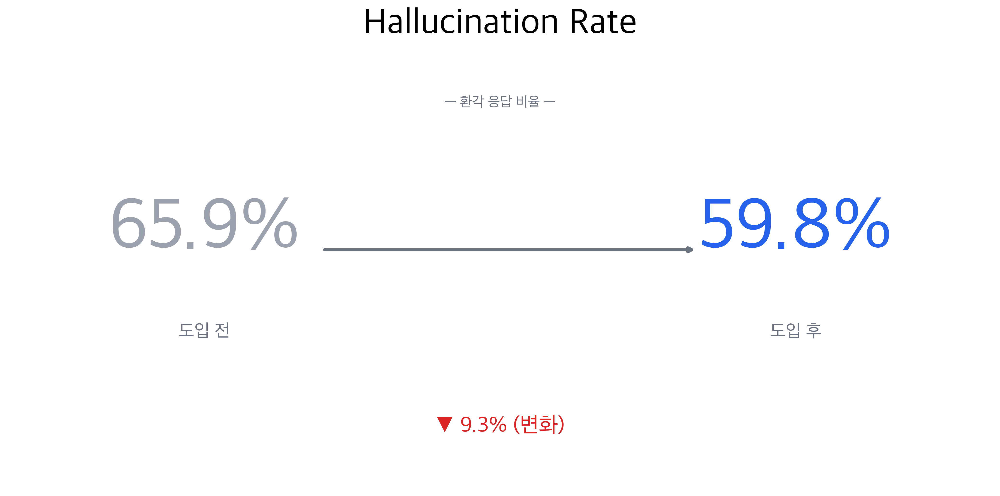

# Mediforme Chatbot — RAG 도입 전 베이스라인 (2026-04-21)

**한 줄 결론:** 현재 챗봇은 의약품 질문 82건 중 66%에서 hallucination 발생. 약 메타데이터 앵커링만으로도 **정확도 +17%, hallucination −9%** 개선되나, **RAG 도입 없이는 환자 서비스 수준 미달**.

---

---

## 핵심 수치

| 지표 | A (현재) | B (앵커링) | 변화 |
|---|---:|---:|---|
| Judge Accuracy | 2.49 / 5 | 2.92 / 5 | **+17%** |
| Helpfulness | 2.87 / 5 | 3.38 / 5 | **+18%** |
| Hallucination | **65.9%** | **59.8%** | **−9.3%** |

- 특히 **최신·해외 약물(위고비·마운자로·팍스로비드 등)** 에서 개선 폭이 국내 OTC 대비 3배 크게 나타남(−10.7%p vs −3.7%p).
- 다만 82건 중 **38건(46%) 은 A·B 모두 hallucination** — 앵커링만으로는 해결 불가.

---

## 다음 단계

**Version C (RAG) 진행 근거 확보 완료.** FDA openFDA · MFDS 라벨을 pgvector 에 임베딩, 약 ID 기반 retrieval 로 실제 근거 청크를 컨텍스트에 주입하는 구조로 설계합니다. 같은 골든셋 82문항으로 재측정하여 B→C 개선폭을 수치로 확인합니다.

---

- 본편 리포트: [`2026-04-21-A-vs-B-baseline.md`](./2026-04-21-A-vs-B-baseline.md)
- 차트 원본: [`charts/`](./charts/)
- 원시 결과: [`../results/A-baseline-20260421T064908Z.json`](../results/A-baseline-20260421T064908Z.json), [`../results/B-anchoring-20260421T071438Z.json`](../results/B-anchoring-20260421T071438Z.json)
