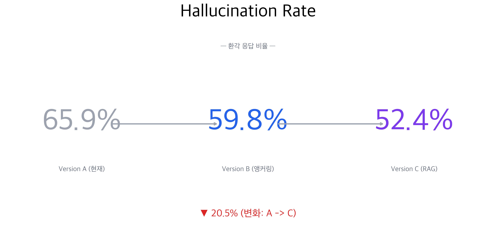
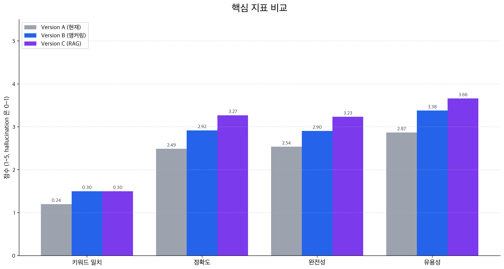
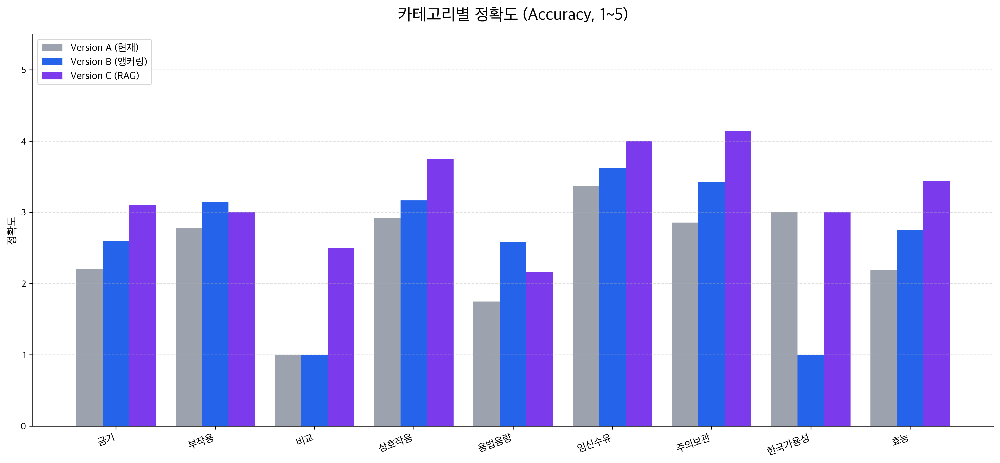
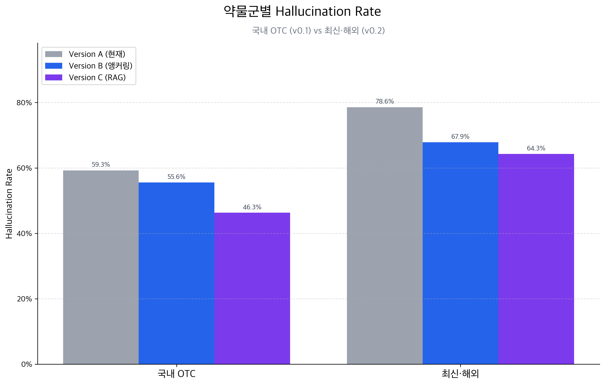

# Chatbot RAG 전환 — Version A/B/C 3-way 측정 리포트

- **측정일**: 2026-05-21
- **대상**: Mediforme Chatbot 도메인
- **범위**: Version A (현재 프로덕션 재현) vs Version B (약 메타데이터 앵커링) vs **Version C (RAG 라벨 검색 주입)**
- **골든셋**: v0.1 + v0.2 (총 82문항, 모든 항목 `verified:false`)
- **선행 리포트**: [2026-04-21 A vs B 베이스라인](2026-04-21-A-vs-B-baseline.md)

---

## 1. 요약 (Executive Summary)

A vs B 베이스라인 리포트는 "앵커링만으로는 hallucination 이 59.8% 로 여전히 높으니 Version C(RAG) 를 진행할 정당성이 있다" 로 끝났습니다. 이번 측정은 그 Version C 를 실제로 붙여, 동일한 골든셋·judge·지표로 A/B/C 를 한자리에서 비교한 결과입니다.

Version C 는 사용자 질문과 약 식별자(generic 성분명)를 검색 서비스(mediforme-chatbot-rag)의 `/retrieve` 로 보내, 해당 약의 FDA·MFDS 라벨 청크를 받아 시스템 프롬프트 컨텍스트로 주입한 뒤 답변을 생성합니다.

결과적으로 **RAG 가 앵커링보다 한 단계 더 품질을 끌어올렸습니다.** hallucination 은 A 65.9% → B 59.8% → **C 52.4%** 로 단조 감소했고, judge 정확도·완전성·유용성은 모두 A < B < C 로 단조 증가했습니다. 특히 **hard 난이도 질문에서 효과가 가장 큽니다** — 정확도가 B 2.24 에서 C 3.44 로 뛰었고(+1.20), hallucination 은 68% → 40% 로 떨어졌습니다. 사전학습 지식이 부족한 어려운 질문일수록 실제 라벨 근거를 주입하는 RAG 의 가치가 분명해집니다.

다만 한계도 함께 드러났습니다. hallucination 은 여전히 52% 로 환자 서비스 기준에는 미달이고, 검색 인덱스에 없는 약(무코펙트)·쉬운 질문·용법용량 카테고리에서는 RAG 가 거의 또는 전혀 기여하지 못했습니다.

**Hero 지표**



---

## 2. 측정 환경

| 항목 | 값 |
|---|---|
| 생성기 모델 | `gpt-3.5-turbo` (A/B/C 동일 — 모델 효과가 아닌 컨텍스트 효과를 분리) |
| Judge 모델 | `gpt-4o` (`response_format=json_object`) |
| 검색 서비스 | mediforme-chatbot-rag `/retrieve` (BGE-M3 + FAISS, 시드 620종) |
| Version C drug_id | 골든셋 `ingredient_en` (복합제는 첫 성분) |
| 검색 top_k | 5 (컨텍스트 토큰 예산 12,000 으로 trim) |
| 골든셋 | v0.1 (국내 OTC 8종·54문항) + v0.2 (최신·해외 8종·28문항) |
| 골든셋 검증 상태 | 전 항목 `verified:false` (한계 참조) |

**측정 중 발견·수정한 것**

- **검색이 OTC 약에 빈 컨텍스트를 반환하던 버그**: 필터가 "유사도 top-N 후보 → drug_id 필터" 순서라, 한국어 질의가 영어 라벨 청크를 상위에 못 올리면 필터 후 0건이 됐습니다(예: acetaminophen 청크 30개가 있는데도 0건). 검색 서비스를 scoped retrieval(필터 시 후보를 인덱스 전체로 확장)로 수정해 해결했습니다.
- **생성 모델 컨텍스트 초과**: 표·화학명이 많은 라벨은 토큰 밀도가 높아 top_k 청크가 16,385 토큰을 넘겼습니다(한 항목 20,207 토큰). 컨텍스트를 토큰 예산으로 trim 하도록 보강했습니다.

**재현 명령**

```bash
cd eval/chatbot-rag
python3 -m venv .venv && .venv/bin/pip install -r requirements.txt
# .env 에 OPENAI_API_KEY, RAG_SERVICE_URL 설정 + 검색 서비스 기동
.venv/bin/python run_eval.py --version C
.venv/bin/python charts.py \
  --a results/A-baseline-<ts>.json \
  --b results/B-anchoring-<ts>.json \
  --c results/C-rag-<ts>.json \
  --out reports/charts --date 2026-05-21
```

---

## 3. 전체 지표 비교



| 지표 | A (현재) | B (앵커링) | C (RAG) | Δ B→C | Δ A→C |
|---|---:|---:|---:|---:|---:|
| Keyword Recall | 0.240 | 0.300 | 0.300 | ±0.00 | +0.060 |
| Judge Accuracy (1-5) | 2.49 | 2.92 | **3.27** | +0.35 | **+0.78** |
| Judge Completeness | 2.54 | 2.90 | **3.23** | +0.33 | +0.69 |
| Judge Helpfulness | 2.87 | 3.38 | **3.66** | +0.28 | +0.79 |
| Hallucination Rate | 65.9% | 59.8% | **52.4%** | −7.4%p | **−13.5%p** |

판정 기반 품질 지표(정확도·완전성·유용성)는 A < B < C 로 일관되게 올라가고, hallucination 은 일관되게 내려갑니다. RAG 가 앵커링 위에 추가로 의미 있는 개선을 얹는다는 것이 수치로 확인됩니다.

다만 **keyword recall 은 B 와 같은 0.30 에 머물렀습니다.** 라벨 컨텍스트를 주입해도 judge 가 평가하는 "표현·근거 품질" 은 좋아지지만, 골든셋이 기대하는 특정 키워드를 더 많이 맞히지는 못했습니다. 키워드 일치는 표면적 지표라 judge 품질 개선과 따로 움직일 수 있습니다.

---

## 4. 난이도별 비교 — RAG 의 핵심 가치

| 난이도 | n | A acc | B acc | C acc | A→C |
|---|---:|---:|---:|---:|---:|
| easy | 21 | 3.19 | 3.62 | 3.43 | +0.24 |
| medium | 36 | 2.39 | 2.97 | 3.06 | +0.67 |
| hard | 25 | 2.04 | 2.24 | **3.44** | **+1.40** |

| 난이도 | A halluc | B halluc | C halluc |
|---|---:|---:|---:|
| easy | 57.1% | 47.6% | 57.1% |
| medium | 69.4% | 66.7% | 58.3% |
| hard | 68.0% | 60.0% | **40.0%** |

**Version C 의 가치는 hard 질문에 집중됩니다.** baseline 리포트에서 "hard 질문은 앵커링 효과가 가장 작다(+0.20). LLM 학습 데이터에 정보 자체가 부족한 경우 약 이름만 알려주는 것으로는 해결되지 않으며, RAG 가 가장 가치 있게 기여할 구간" 이라고 예측했는데, 그 예측이 정확히 맞았습니다. hard 정확도가 B 2.24 에서 C 3.44 로 뛰고, hallucination 이 60% 에서 40% 로 떨어집니다.

반대로 **easy 질문에서는 RAG 가 오히려 B 보다 약간 낮습니다**(acc 3.62 → 3.43, hallucination 47.6% → 57.1%). 모델이 이미 잘 아는 쉬운 질문에는 라벨 컨텍스트가 도움보다 노이즈로 작용할 수 있음을 시사합니다.

---

## 5. 카테고리별 정확도



| 카테고리 | n | A acc | B acc | C acc | B→C |
|---|---:|---:|---:|---:|---:|
| 주의보관 | 7 | 2.86 | 3.43 | **4.14** | +0.71 |
| 임신수유 | 8 | 3.38 | 3.63 | **4.00** | +0.37 |
| 상호작용 | 12 | 2.92 | 3.17 | **3.75** | +0.58 |
| 효능 | 16 | 2.19 | 2.75 | **3.44** | +0.69 |
| 금기 | 10 | 2.20 | 2.60 | **3.10** | +0.50 |
| 비교 | 2 | 1.00 | 1.00 | 2.50 | +1.50 |
| 부작용 | 14 | 2.79 | 3.14 | 3.00 | −0.14 |
| 용법용량 | 12 | 1.75 | 2.58 | 2.17 | **−0.41** |

**관찰**

- baseline 리포트가 "RAG 로 실제 라벨 `pregnancy`·`drug_interactions` 섹션을 주입하면 크게 개선될 후보" 로 지목했던 **임신수유·상호작용** 이 실제로 크게 올랐습니다(상호작용 +0.58, 임신수유 4.0 도달). 가설이 검증됐습니다.
- **금기·주의보관** 처럼 라벨에 명시적 근거가 있는 카테고리도 큰 개선을 보입니다. 환자 안전과 직결되는 영역이라 의미가 큽니다.
- **용법용량은 오히려 회귀**했습니다(B 2.58 → C 2.17). 앵커링이 가장 잘 살리던 카테고리였는데, 검색된 여러 라벨 섹션이 단순한 용량 질문에 노이즈를 더한 것으로 추정됩니다. 카테고리→섹션 매핑(용법용량 질의는 `dosage_and_administration` 섹션만 검색)으로 보강할 후보입니다.
- **비교**(마운자로 vs 오젬픽 등)는 1.0 → 2.5 로 일부 개선됐으나, 현재 version C 는 drug_id 하나로만 필터하므로 두 약을 동시에 검색하지는 못합니다. n=2 라 해석에 주의가 필요합니다.

---

## 6. 약물군별 Hallucination



| 약물군 | A | B | C |
|---|---:|---:|---:|
| 국내 OTC (v0.1) | 59.3% | 55.6% | **46.3%** |
| 최신·해외 (v0.2) | 78.6% | 67.9% | **64.3%** |

두 군 모두 C 에서 hallucination 이 추가로 감소합니다. 다만 최신·해외 약물군은 여전히 64.3% 로 높은데, 이는 다음 두 요인이 겹친 결과로 보입니다. (1) v0.2 에는 비교·복합제 질문이 많아 단일 drug_id 검색으로는 한계가 있고, (2) 최신 약물의 라벨 섹션이 길고 표가 많아 토큰 trim 으로 일부 컨텍스트가 잘립니다.

---

## 7. 검색 커버리지의 영향

Version C 의 효과는 검색 인덱스가 해당 약을 커버할 때만 발휘됩니다. 골든셋 16종 중 15종은 인덱스에 존재하지만, **무코펙트(암브록솔)는 한국 OTC 라 FDA 시드에 없어 미커버**입니다. 이 7문항은 컨텍스트가 비어 RAG 가 사실상 작동하지 못합니다.

| 구간 | n | C hallucination | C accuracy |
|---|---:|---:|---:|
| 커버되는 약 | 75 | 52.0% | 3.33 |
| 무코펙트(미커버) | 7 | 57.1% | 2.57 |

미커버 7문항을 빼면 커버 구간 정확도는 3.33 으로 더 높습니다. **"RAG 는 검색 커버리지가 있는 곳에서만 효과" 가 수치로 확인됩니다.** 시드에 무코펙트(및 다른 한국 OTC) 를 추가하는 것이 가장 직접적인 다음 레버입니다.

---

## 8. 운영 관점

| 항목 | A | B | C |
|---|---:|---:|---:|
| p50 latency (ms) | 2,256 | 2,440 | 3,538 |
| p95 latency (ms) | 4,693 | 4,226 | 7,930 |
| 입력 토큰 총계 | 2,352 | 18,050 | **162,311** |
| 출력 토큰 총계 | 17,720 | 19,814 | 21,796 |

- **입력 토큰이 A 대비 약 69배, B 대비 약 9배** 늘었습니다. 매 요청마다 라벨 청크를 컨텍스트로 주입하기 때문입니다. `gpt-3.5-turbo` 입력 단가($0.50/1M)로 보면 절대 비용은 82문항 합계 약 $0.08 수준으로 작지만, 트래픽이 늘면 의미 있는 비용 항목이 됩니다. 검색 서비스 호출(`/retrieve`) 비용은 별도이나 자체 LLM 호출이 없어 저렴합니다.
- latency 도 증가합니다(p50 +57%, p95 +69%). `/retrieve` 호출 1회 + 더 긴 프롬프트 생성이 더해진 결과입니다. 그래도 p95 8초 이내로 대화형에 수용 가능한 범위입니다.
- 토큰 예산 trim 으로 컨텍스트를 12,000 토큰으로 제한하므로 입력 비용·latency 의 상한은 안정적으로 잡혀 있습니다.

---

## 9. 결론 및 권고

### 수치로 확인된 것

- RAG 는 앵커링 위에 추가 개선을 얹습니다 — 정확도 +0.35, hallucination −7.4%p (B→C).
- **hard 질문에서 가장 강력합니다** — 정확도 +1.20, hallucination −20%p (B→C). 사전학습 지식이 부족한 영역에 실제 근거를 공급하는 RAG 의 본래 목적이 검증됐습니다.
- baseline 리포트가 RAG 개선 후보로 지목했던 **임신수유·상호작용·금기** 카테고리가 실제로 크게 올랐습니다.

### 수치로 확인된 한계

- hallucination 52.4% 로 **여전히 환자 서비스 기준 미달**.
- **easy 질문·용법용량 카테고리는 회귀** — 컨텍스트가 노이즈로 작용하는 구간 존재.
- **검색 미커버 약(무코펙트)은 효과 없음** — 시드 커버리지가 전제.
- **비교·복합제 질문**은 단일 drug_id 검색으로 한계.

### 권고 — 다음 단계

1. **시드 커버리지 확대**: 한국 OTC(무코펙트 등) 를 시드에 추가해 미커버 구간 제거.
2. **카테고리→섹션 매핑**: 용법용량 질의는 `dosage_and_administration` 섹션으로 좁혀 노이즈 회귀를 잡기.
3. **다중 약 검색**: 비교 질문은 drug_id 를 복수로 받아 두 약 라벨을 동시에 주입.
4. **easy 질문 컨텍스트 절제**: 쉬운 질의는 컨텍스트를 줄이거나 생략하는 라우팅 검토.

---

## 10. 한계 및 주의

### 10.1 골든셋 검증 안 됨

전 항목 `verified:false`. expected_answer·ground_truth_keywords 가 실제 라벨과 완전히 일치하지 않을 수 있어 **절대 점수** 신뢰도는 낮습니다. 다만 A/B/C 에 동일 잣대가 적용되므로 **상대 비교**의 방향성은 유지됩니다.

### 10.2 Judge self-preference bias

생성기·judge 가 모두 OpenAI 계열입니다(생성 gpt-3.5-turbo, judge gpt-4o). 버전 차이로 일부 분리되지만 완전히 독립적이지는 않습니다.

### 10.3 검색 커버리지·trim 영향

미커버 약(무코펙트)과 토큰 trim 으로 일부 컨텍스트가 잘리는 점이 C 점수의 상한을 누릅니다. 즉 **여기 수치는 RAG 의 하한에 가깝고**, 커버리지·매핑 보강 시 더 오를 여지가 있습니다.

### 10.4 통계적 유의성·비결정성

82문항은 탐색적 결론에 충분하나 카테고리별로는 표본이 작습니다(비교 n=2, 한국가용성 n=1). 생성 `temperature` 미지정(기본 1.0)이라 단일 측정 노이즈가 포함됩니다.

---

## 11. 관련 자료

- 이슈: [#60](https://github.com/medi4me/backend_medi/issues/60) (Version C 러너), [#62](https://github.com/medi4me/backend_medi/issues/62) (리포트)
- 선행: [#58 A vs B 베이스라인 리포트](https://github.com/medi4me/backend_medi/issues/58)
- 검색 서비스 scoped retrieval 수정: mediforme-chatbot-rag [PR #38](https://github.com/medi4me/mediforme-chatbot-rag/pull/38)
- 검색 구성 근거(모델·헤더·시드·필터): mediforme-chatbot-rag wiki [RAG 구성 종합 비교](https://github.com/medi4me/mediforme-chatbot-rag/wiki/RAG-구성-종합-비교)

## 12. 원시 결과 데이터

- `eval/chatbot-rag/results/A-baseline-20260421T064908Z.json` — Version A
- `eval/chatbot-rag/results/B-anchoring-20260421T071438Z.json` — Version B
- `eval/chatbot-rag/results/C-rag-20260521T084613Z.json` — Version C
